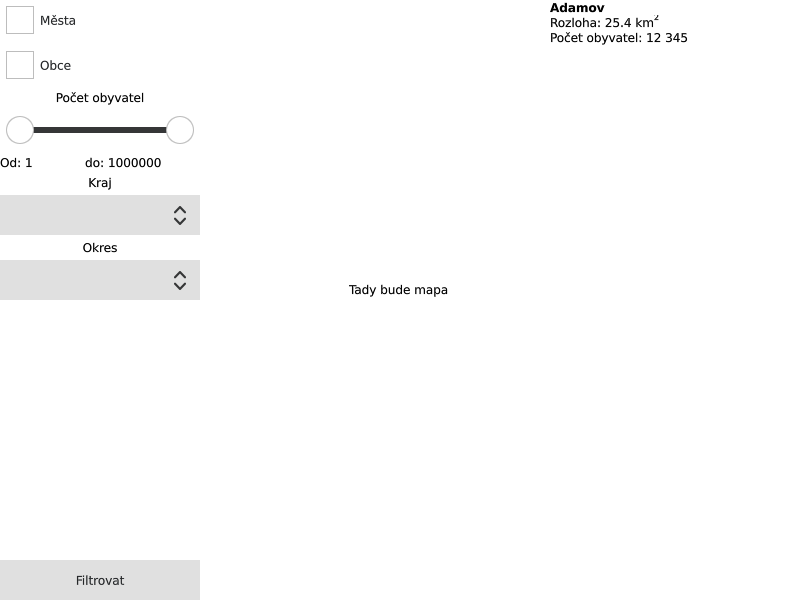

# Prohlížeč měst a obcí

## Zadání
Implementujte program, který umožní uživateli vyfiltrovat města a obce podle
zadaných parametrů a zobrazí je na mapě a v seznamu vedle ní.

Možná podoba grafického rozhraní:

Grafické rozhraní by mělo zachovávat vzhled při změně velikosti okna a při zvětšování okna by se měla zvětšovat komponenta mapy.

### Požadované filtry
  * města / obce / obojí / nic
  * počet obyvatel - jak pomocí posuvníku, tak pomocí textových polí
  * kraj - všechny nebo jeden vybraný
  * okres - zobrazí okresy pouze z daného kraje, možnost buď všechny okresy z
    kraje, nebo jeden konkrétní

### Zobrazení na mapě
Vyfiltrovaná sídla budou zobrazena na slepé mapě jako bod s popisem, města
červeně a tučně, obce černě. Při změně množiny vyfiltrovaných měst se mapa
automaticky upraví tak, aby byla zobrazena všechna vyfiltrovaná sídla. Pokud je
zvoleno některé sídlo v seznamu vpravo, pak se mapa přiblíží na zoom 12 tak, aby
vybrané sídlo bylo uprostřed.

### Seznam sídel
Seznam sídel bude obsahovat všechna vyfiltrovaná sídla a u každého alespoň
následující informace:
  * název sídla
  * zda jde o město
  * rozlohu
  * počet obyvatel

Informaci, zda jde o město, lze vyjádřit graficky tak, že jméno sídla bude
červeně. 

Při kliknutí na položku sídla v seznamu se položka vybere a vystředí se na ni
mapa (viz Zobrazení na mapě). 

### Dokumentace
K aplikaci dodejte stručnou uživatelskou a vývojářskou dokumentaci a objektový
návrh, ve kterém popíšete architekturu aplikace - které modely drží jaká data a
jak jsou spolu propojeny a jak spolu interagují. Propojení můžete znázornit i
graficky (např. pomocí UML např. v nástroji Dia). 

## Doporučení
Nejprve si nakreslete, jak bude architektura aplikace vypadat a jak se budou
předávat data a pak teprve programujte. Rozdělte si jednotlivé funkční celky
mezi sebe a domluvte se na rozhraní mezi nimi.

Navrhněte si kompletní grafické rozhraní a pak ho oživujte. Využijte obousměrné
vazby mezi objekty v rámci grafického rozhraní.

Pokud se vám něco nebude dařit, zkonzultujte to s ostatními ve skupině, pokud si
stále nebudete vědět rady, nebojte se ozvat, rád vám pomohu.

## Odevzdání
Odevzdávat budete zdrojové soubory a soubor(y) s dokumentací. Součástí úkolu je
i příprava zdrojových dat, tedy v tomto úkolu odevzdáváte i data o sídlech tak,
aby aplikace šla spustit a provozovat bez stahování dalších dat. Odevzdávejte
ideálně přes GitHub nebo podobnou službu, případně je možné poslat i vše
zabalené v zipu.

Deadline na odevzdání je 11. 4. 2021 v 8.03. Úkoly odeslané po deadlinu budou
brány jako neodevzdané. Pokud odevzdáte úkol vícekrát, budu hodnotit poslední
odevzdání před deadlinem.  Každému, kdo mi pošle úkol, odpovím, že jsem ho
přijal a že se mi podařilo zip rozbalit. Pokud neodpovím, urgujte.

### Předčasné odevzdání
Pokud odevzdáte úkol dopředu, zkusím se na něj podívat a napsat vám případné
nedostatky. Tato možnost není garantovaná, ale budu se snažit odbavovat úkoly co
nejrychleji. Zaručuji vám pouze to, že na úkoly se budu dívat v tom pořadí, v
jakém mi budou doručeny. Rovněž nezaručuji, že najdu v programu všechny chyby
napoprvé, tudíž pokud si nějaké nevšimnu, není to garance, že máte program
správně, závazné je pouze hodnocení po deadlinu. Pokud budete odevzdávat přes
GitHub, chyby vám vystavím jako Issue.

## Bodování
  * 4 b za funkční aplikaci
  * 3 b za kvalitu kódu
  * 3 b za dokumentaci

## Bonusové body (max 6 b z níže uvedených)

### Automatizovaná příprava dat (1 b)
Kromě aplikace samotné připravíte i skript, který stáhne aktuální data z veřejně
dostupných zdrojů a připraví je tak, aby se daly použít v aplikaci bez dalších
úprav. Skript může, ale nemusí, být součástí aplikace.

### Přidání vlastí filtrovací kategorie (1 -- 2 b)
Aplikace bude umožňovat filtrovat podle vámi zvolené další kategorie. Počet bodů
závisí na náročnosti implementace.

### Zobrazení znaku sídla (1 -- 2 b)
Aplikace zobrazí u vyfiltrovaných sídel i jejich znak (alespoň u většiny sídel).
1 bod za zobrazení v seznamu, 1 bod za zobrazení v mapě. Znaky nemusí být
součástí aplikace, je možné je stáhnout až při používání aplikace. Hint: QML
umožňuje jako `source` libovolnou URL.

### Uložení vyfiltrovaných sídel do souboru (2 b)
Aplikace po kliknutí na tlačítko uložit vyvolá ukládací dialog, kde si uživatel
vybere, kam chce uložit soubor s vyfiltrovanými sídly a aplikace ho tam vytvoří.
Tento soubor by měl obsahovat všechna data o sídlech, která má aplikace k
dispozici a jeho formát by měl být součástí dokumentace.

### Živé filtrování (2 b)
Při změně kritérií pro filtrování se hned změní seznam a mapa, není potřeba
klikat na tlačítko Filtrovat. 
