# Instalace modulů pro geografická data do Pythonu

## Instalace Anacondy a balíčků
Anaconda je správce balíčků pro Python a R. Je podobná pipu, ale na rozdíl od něj umí nainstalovat i větší balíky souvisejících knihoven, které pip nainstalovat neumí, například gdal. Je vhodné v jednom prostředí používat buď anacondu, nebo pip a nemíchat je. Veškerá práce s Anacondou je poněkud zdlouhavá, obrňte se proto trpělivostí.

Tento návod používá grafické rozhraní Anaconda Navigator. Pro další možnosti využití si přečtěte [uživatelskou příručku](https://docs.anaconda.com/anaconda/navigator/), případně [podrobnější sekci věnovanou balíčkům](https://docs.anaconda.com/anaconda/navigator/tutorials/manage-packages/).

Mimo aplikace Anaconda Navigator má Anaconda i klienta pro příkazovou řádku jménem conda. Pro jeho používání si přečtěte [uživatelskou příručku](https://conda.io/projects/conda/en/latest/user-guide/getting-started.html), případně [podrobnější sekci věnovanou balíčkům](https://conda.io/projects/conda/en/latest/user-guide/tasks/manage-pkgs.html).

  - stáhněte a nainstalujte si [Anacondu](https://www.anaconda.com/products/individual)
  - otevřete si Anaconda Navigator (měl by přibýt v nabídce Start)
  - v seznamu vlevo se přepněte do Environments
  - pomocí Channels -> Add přidejte repozitář conda-forge¨
  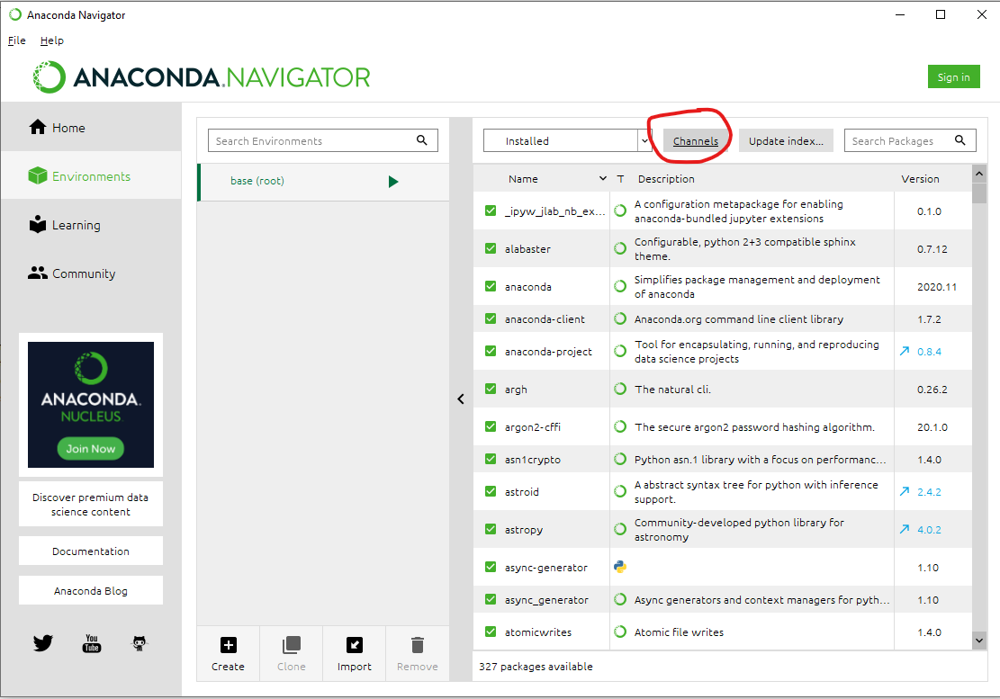
  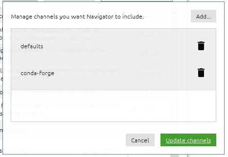
  - pomocí Create si vytvořte nové prostředí (v tomto návodě pojmenovné geopython, ale můžete ho pojmenovat i jinak)
  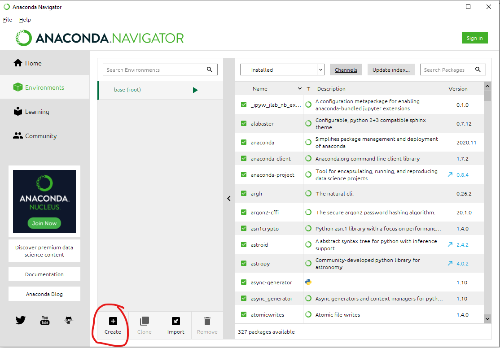
  - zvolte pouze Python nejnovější verze, kterou vám nabídne, zapamatujte si cestu uvedenou u Location
  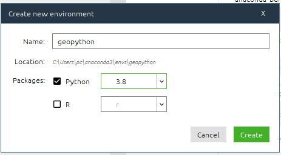
  - po vytvoření si toho nové prostředí zvolte a v pravé části v rozbalovacím menu vyberte All místo Installed
  - do vyhledávacího pole zadejte gdal
  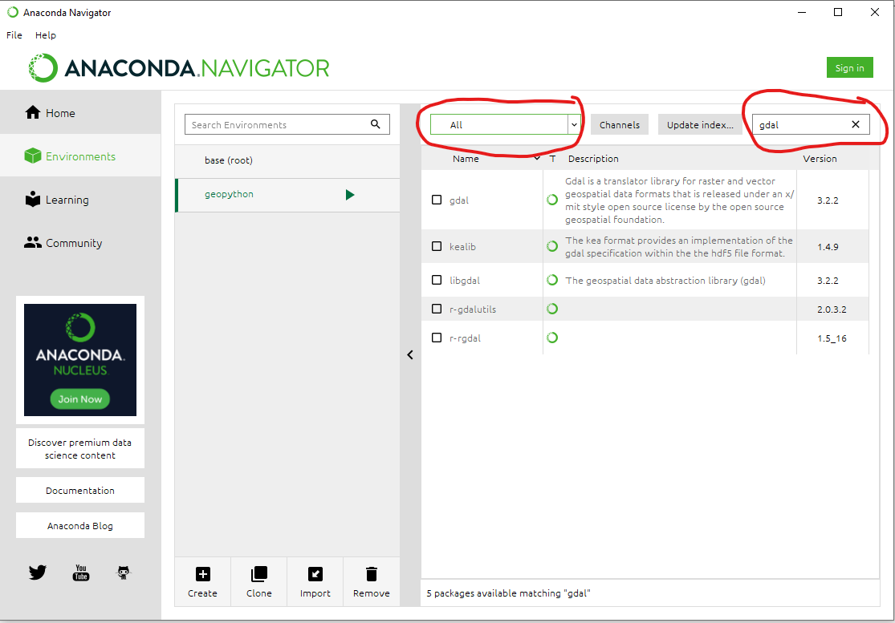
  - zaklikněte, že ho chcete nainstalovat a dejte Apply
  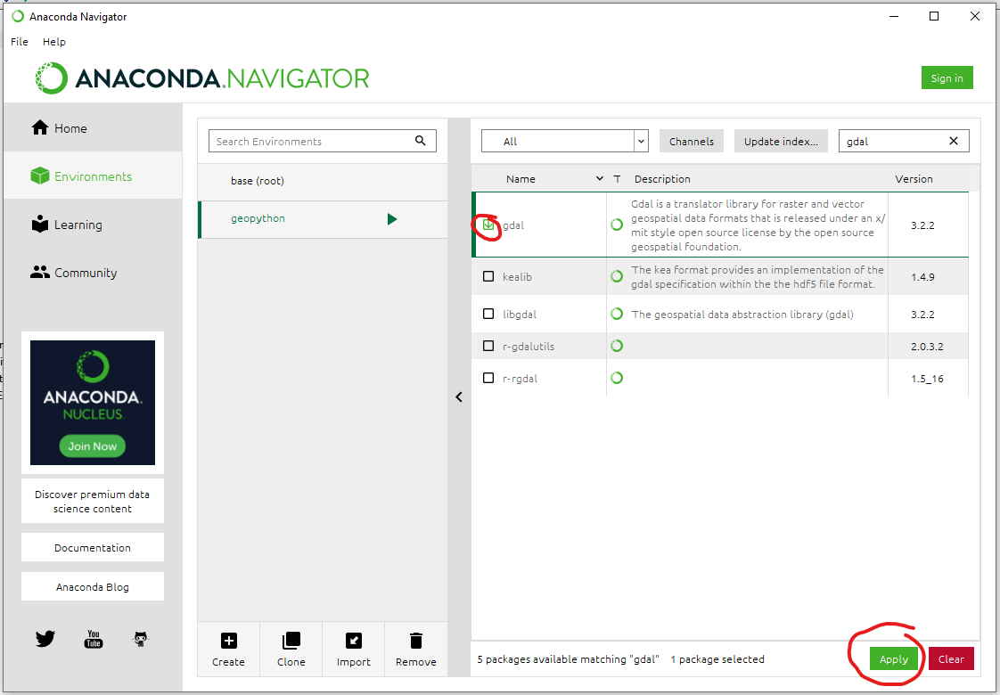
  - až se Anaconda rozmyslí, co chce instalovat, instalaci potvrďte a vyčkejte, až se balíčky nainstalují
 
 Pro zobrazení grafů a sítí je potřeba Matplotlib ve verzi 2.x, bude tedy třeba Anacondě určit, jakou verzi má nainstalovat
  - vyhledejte matplotlib
  - na zaškrtávací políčko klikněte pravým tlačítkem
  - v menu, které se objevilo, zvolte Mark for specific version installation a zvolte nejnovější verzi, která začíná dvojkou (pravděpodobně 2.2.5)
  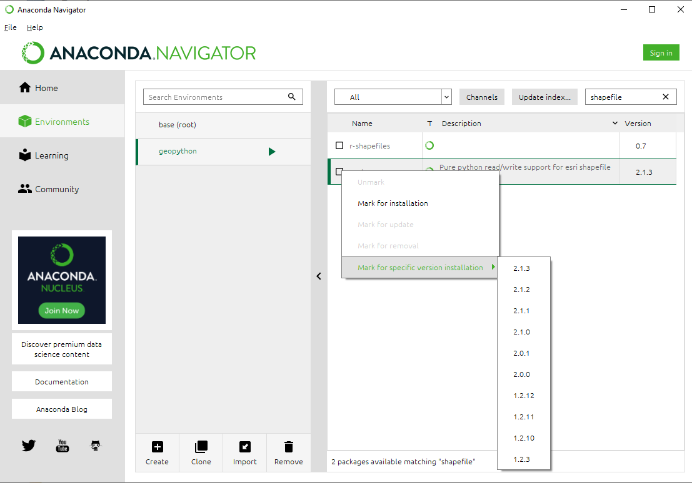
  - dále postupujte jako při běžné instalaci

Podle postupu výše nainstalujte ještě balíček momepy a contextily.

## Nastavení Vistual Studia Code

### Nastavení běžného příkazového řádku místo PowerShellu
S PowerShellem nefungují skripty pro aktivaci a používání virtuálních prostředí Anacondy, proto je potřeba Visual Studio přesvědčit, aby jako terminál používalo obyčejný příkazový řádek. Je možné, že toto nastavení již máte z doby, kdy jste si zkoušeli virtuální prostředí.

  - v záložce Terminal dole rozklikněte menu Python a zvolte Select Default Profile
  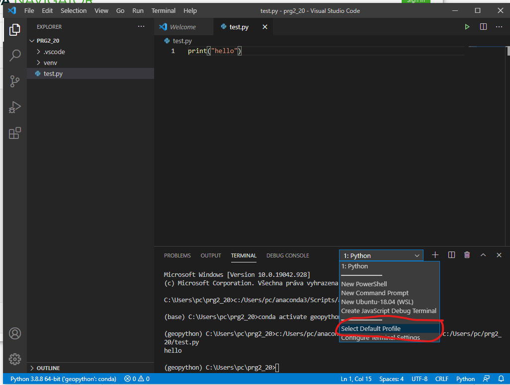
  - v menu nahoře zvolte Command Prompt
  

### Nastavení interpretu Pythonu
Pro používání Visual Studia s prostředím vytvořeným v Anacondě je potřeba nastavit interpretr Pythonu právě na ten umístěný v nově vytvořeném prostředí.

  - pomocí Ctrl-Shift-P otevřete horní menu
  - napište python select a zvolte položku Select Python Interpreter
  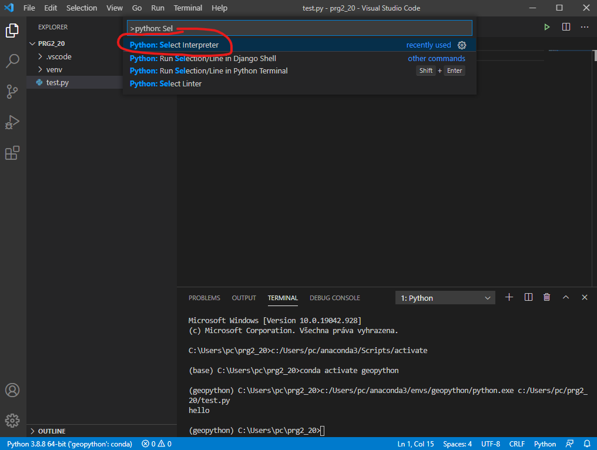
  - pokud ve zvoleném menu je uveden Python a jméno prostředí, které jste vytvářeli v závorce (např. Python 3.8.8 64-bit ('geopython':conda)), zvolte ho a jste hotovi
  - jinak zvolte Enter interpreter path... a v dalším kroku Find...
  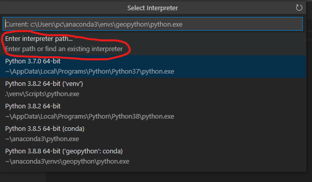
  - zde najděte cestu, kterou jste si měli zapamatovat při vytváření nového prostředí
  - obvykle to bude C:\Users\<jméno_uživatele>\anaconda3\envs\<jméno_prostředí>
  - ve složce daného prostředí najděte program python a zvolte jej
  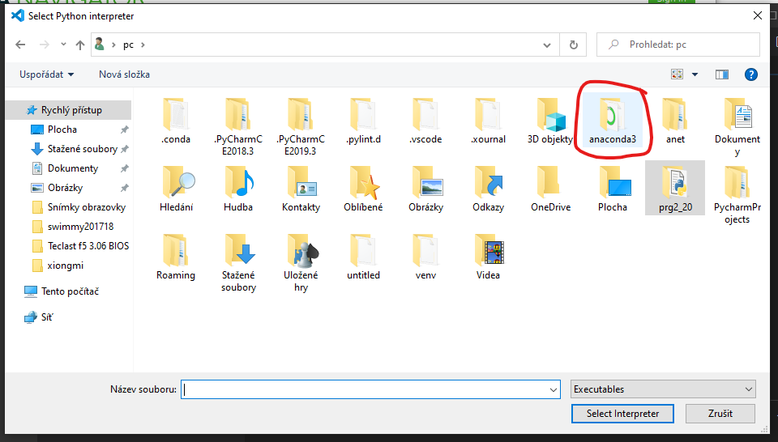
  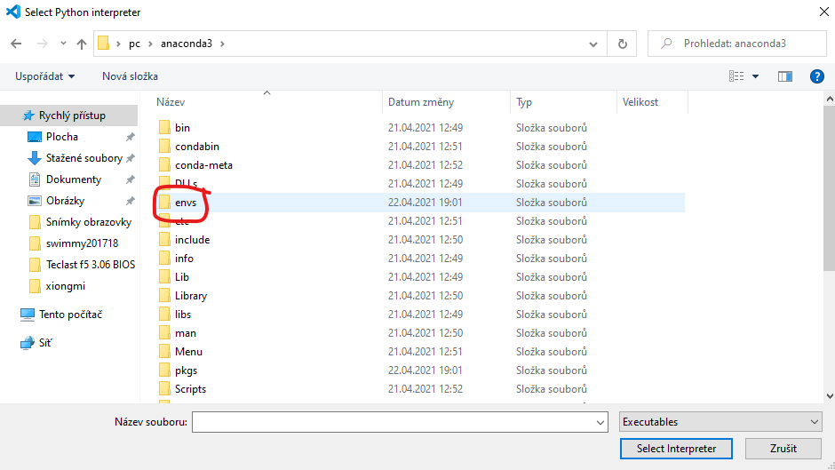
  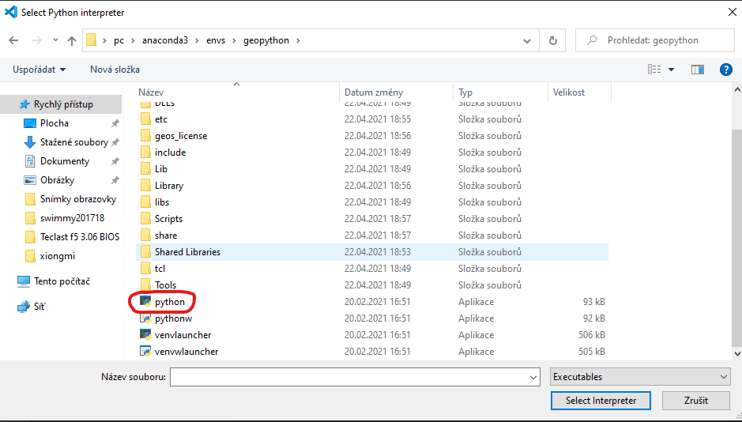

## Spuštění testovacího skriptu
Nainstalované prostředí vyzkoušejte spuštením testovacího skriptu ze [složky 10. cvičení](https://github.com/xtompok/prg2_20/tree/main/cv10).

  - stáhněte si geopython_test.py a streets.geojson
  - ve Visual Studiu si otevřete složku s oběma soubory
  - otevřete si soubor geopython_test.py a spusťte ho
  - měla by se otevřít 2 okna, jedno pouze se sítí ulic, druhé se dvěma sítěmi ulic s mapovým podkladem
  - obě okna zavřete a program by měl skončit

